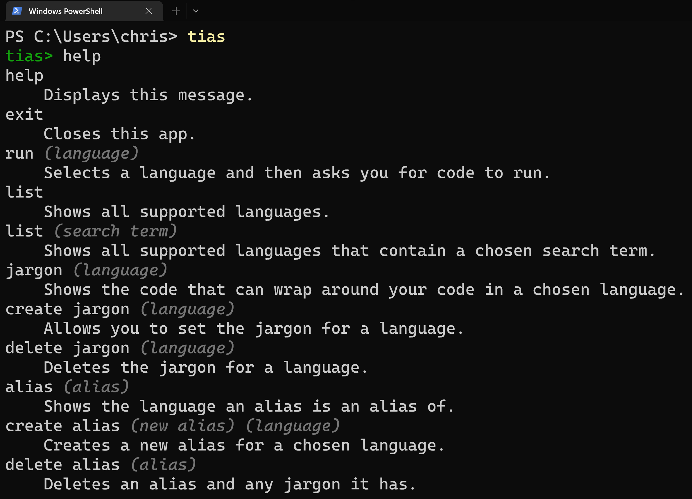

# tias (try it and see)

Quickly run code in almost any language.


Install with `pip install tias`.

## reuse code

Set commonly used code ("jargon") to automatically wrap around the code you enter. Default jargon is given for many languages for one-line hello worlds, including:

**C#**

```cs
System.Console.WriteLine("hello world");
```

**C++**

```cpp
cout << "hello world";
```

**Go**

```go
fmt.Println("hello world")
```

**Java**

```java
System.out.println("hello world");
```

**Rust**

```rust
println!("hello world");
```



Run tias with `py -m tias` or `python3 -m tias`. You can create a custom terminal command to make running this app even easier by following [these instructions](https://wheelercj.github.io/notes/pages/20220320181252.html).

## supported languages

Here are some of the languages:

APL, Assembly, Bash, C, C#, C++, Clojure, COBOL, Crystal, Dart, Elixir, Emacs Lisp, Erlang, F#, Fortran, Go, Groovy, Haskell, Java, JavaScript, Julia, Kotlin, LLVM, LOLCODE, Lua, Malbolge, Objective-C, OCaml, Perl, PHP, PowerShell, Python, R, Ruby, Rust, Scala, SQLite, Swift, TypeScript, and hundreds more (680 total).

## giving input

You can give input to your code by wrapping it with three backticks and then listing the inputs after.


This app uses [tio.run](https://tio.run/#)'s API.
