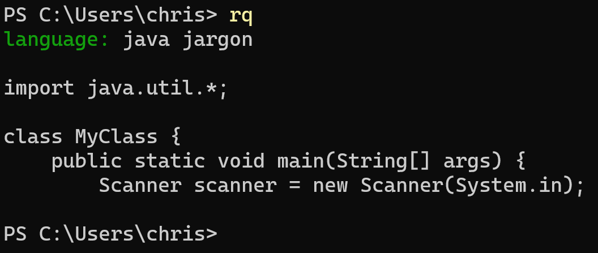
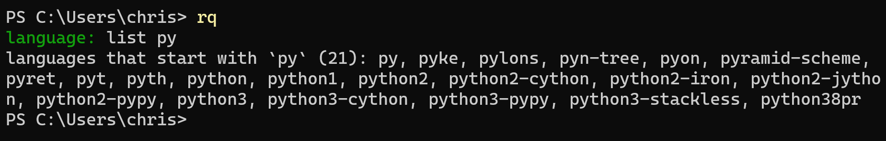
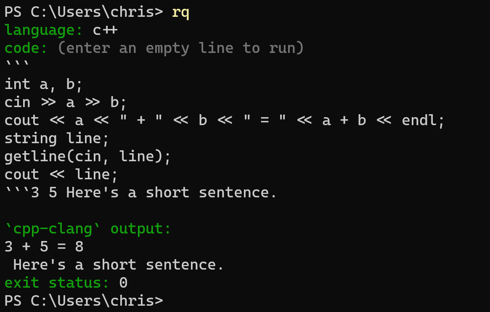

# run quick

Quickly run code in almost any programming language.


This app uses [tio.run](https://tio.run/#)'s API but can also wrap commonly used jargon around your code for faster experimentation. Here are some sample hello world programs in various languages in this app:

**C#**

```cs
System.Console.WriteLine("hello world");
```

**C++**

```cpp
cout << "hello world";
```

**C**

```c
printf("hello world");
```

**Java**

```java
System.out.println("hello world");
```

These super short hello world programs are possible because if you don't create a main function, this app can wrap your code in a main function and import commonly used libraries. Jargon wrapping is available for several languages. You can see a language's optional jargon (and whether a language has optional jargon) by entering ` jargon` after the language name when the app asks you to choose a language.



## supported languages

Here are some of the languages:

APL, Assembly, Bash, C, C#, C++, Clojure, COBOL, Crystal, Dart, Elixir, Emacs Lisp, Erlang, F#, Fortran, Go, Groovy, Haskell, Java, JavaScript, Julia, Kotlin, LLVM, LOLCODE, Lua, Malbolge, Objective-C, OCaml, Perl, PHP, PowerShell, Python, R, Ruby, Rust, Scala, SQLite, Swift, TypeScript, and hundreds more (680 total).

To see the full list, enter `list` when this app asks you which language to use. Some language choices may require you to specify which compiler you want to use. You can filter the results by entering the start of a language after `list `.



## giving input

You can give input to your code by wrapping it with three backticks and then listing the space-separated inputs after.



## download

0. Download Python if you haven't already. This app has been tested with Python 3.9 and 3.10.
1. Download the source code here: https://github.com/wheelercj/run-quick/tags.
2. Unzip the file.
3. You may want to create a virtual environment.
4. Install the dependencies with `pip install -r requirements.txt`.
5. Run main.py.

You can create a terminal command to run this app by following [these instructions](https://wheelercj.github.io/notes/pages/20220320181252.html).
